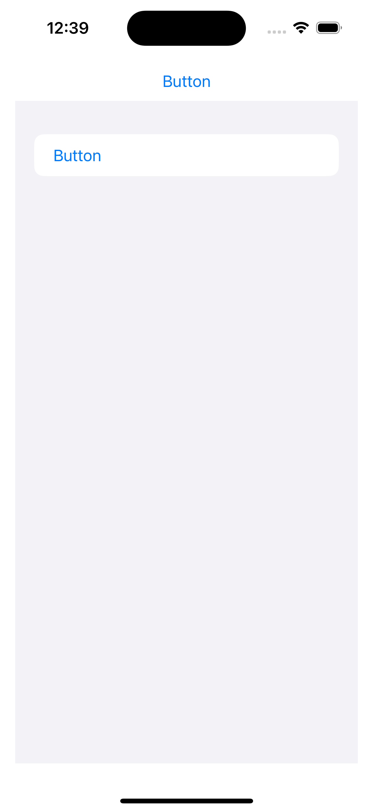

#  FB13498294 - SwiftUI: Button in List not highlighted on tap

## Scenario

A SwiftUI app shows a button in a List. The button is expected to have the same behaviour as a normal button.

## Issue

When the button is tapped, it performs the interaction, but does not show it got interacted with. A normal button outside of a list shows a highlight when tapped.	
	

	
## Example code

The example shows a button outside of the list. It shows a highlight when tapped. 
It also shows a List with a button. It does not show a highlight when tapped.

## Tested on

	- iOS 17.2

